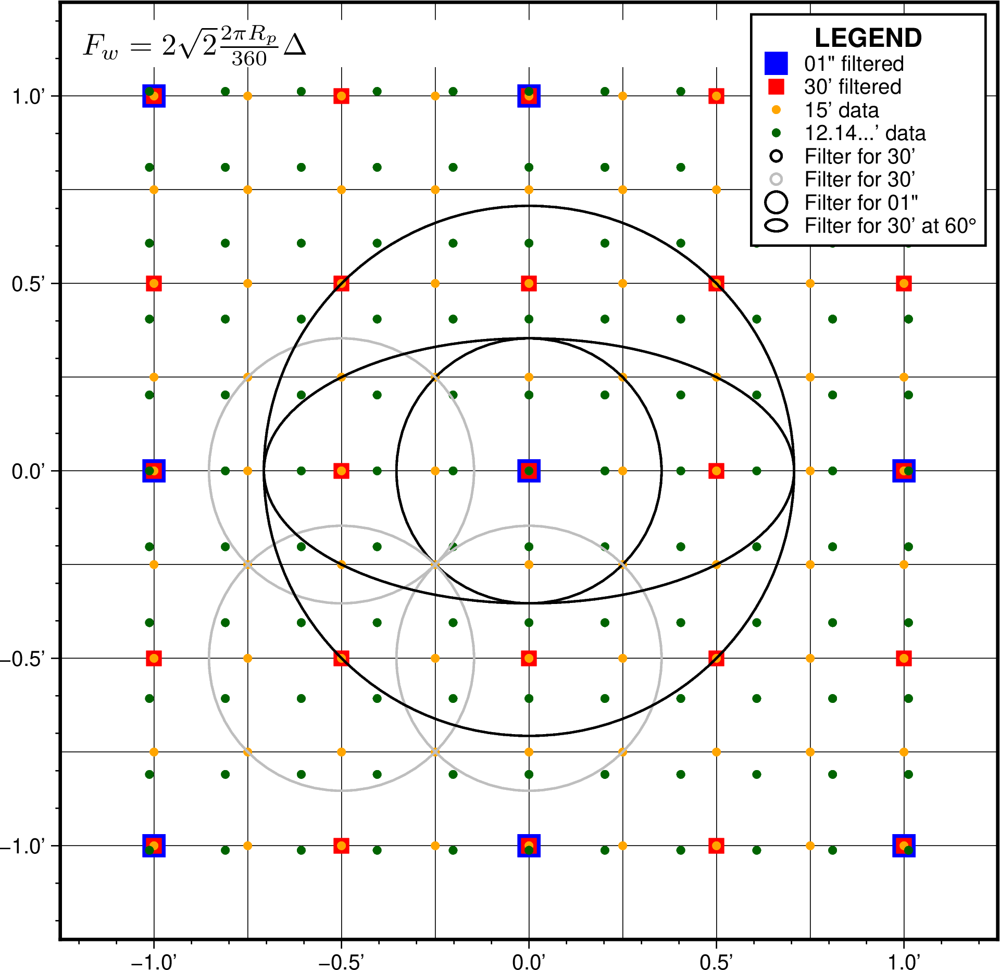
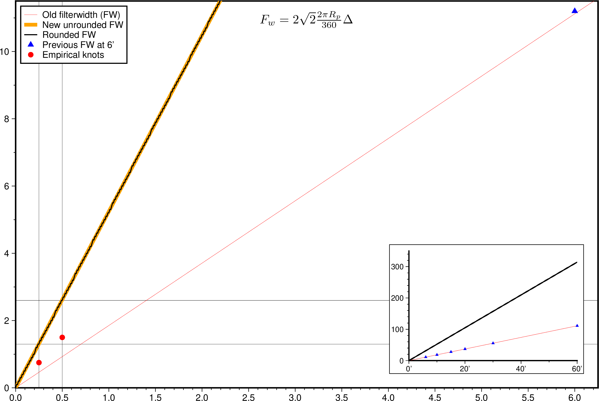
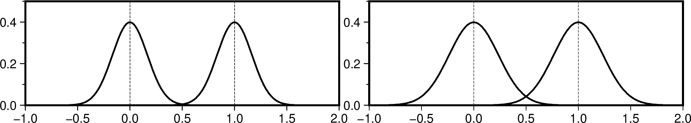

# GMT Data Server Administration

Cache data and scripts for managing the GMT data server

Current master server is: **gmtserver.soest.hawaii.edu**, in directory `/export/gmtserver/gmt/data`

The actual URL is: **www.soest.hawaii.edu/gmt/data** [you cannot browse there]

Master data server URL: **https://oceania.generic-mapping-tools.org**

To clone this repo you can run

```
git clone https://github.com/GenericMappingTools/gmtserver-admin
```

## Cache files

GMT Core developers can add, modify or remove cache files from their working copy
of the gmtserver-admin repo, and after merging the gmt server will automatically
update its working copy via the crontab script that runs every hour, and if there
are changes the `gmt_hash_server.txt` file will be rebuilt as needed.

## Global grids

For now, all Earth and planetary grids are maintained and updated manually.
The production of global grids are based on recipes in the recipes folder
and can be activated via the Makefile. For new data, design a new recipe.
Assuming recipe bugs are worked out, convert the single high-resolution grid
or image to our tiled system via `scripts/srv_downsampler.sh neptune_relief`.
Once successful, tile the downsampled grids via `scripts/srv_tiler.sh neptune_relief`.
If these are satisfactory they can be moved to the candidate server. E.g.,
`make place-neptune-relief`. If after testing we wish to release this data,
run `make server-release`.

## Crontab

The working directory on the gmtserver is updated once an hour via a
crontab script running under local account pwessel with this crontab entry:

```
0 * * * *      /export/gmtserver/gmt/gmtserver-admin/scripts/srv_git_update.sh > /export/gmtserver/gmt/LOGS/git_update.cron.log 2>&1
```

## Downsampling

Here are technical details on how we perform down-sampling. We are filtering, say,
the orange 15s data nodes to make a 30s grid (red squares).  At each output node
we imagine a circle (the small black and three gray for nearby nodes).  We use 2
times sqrt(2) times the output increment in degrees (converted to km) which gives
us the diameter, i.e., the full filter width expected by **grdfilter**.  Because
of this wider circle diameter that touches or includes neighboring output nodes
we assure we have no aliasing and all data points contribute to the filtered output.
**Note**: `R_p` is the planetary radius and `Delta` is the output grid spacing.



With this scheme, we get a filter width versus output grid spacing that looks like this:



If we look at what the filter weights are for the Gaussian filter along a cross-section
through two neighbor nodes we get this:


